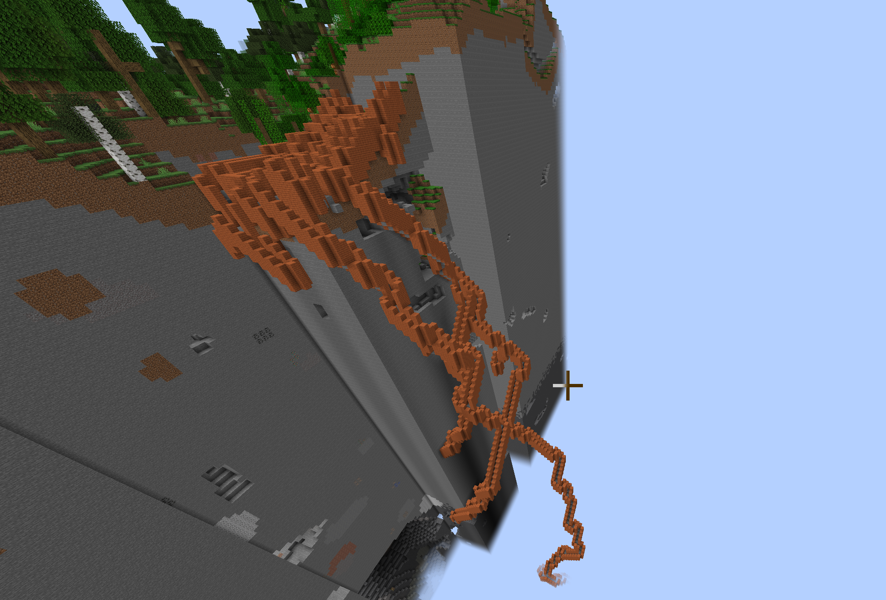
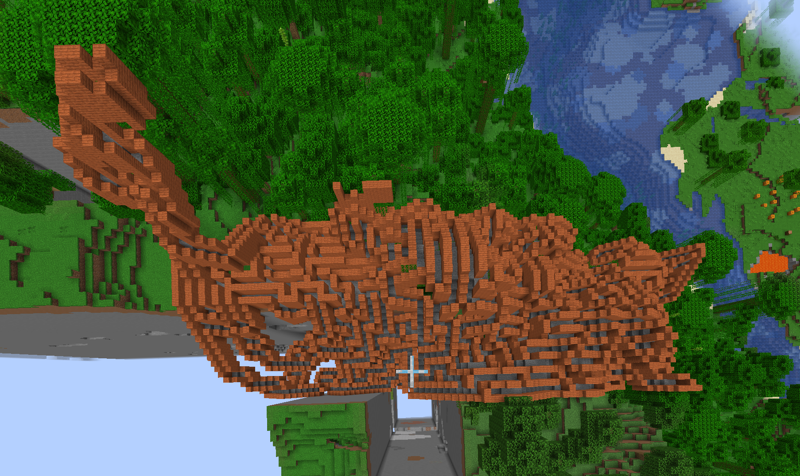

## Code Notes:
    We don't like Object Orientation around here. Input -> output, call it a day
    We keep it functional for the most part
    You can run our entire test suite with either ./test_mac.sh or ./test_winlinux.
    Just make sure the server is on your character is in the world.

    We use auto sparingly, and only in cases where it would be ridiculous not to.
    We have defined typedefs sparingly, and have a couple.

    IMPORTANT:
        You can run the code in 3 modes:

        Normal mode: ./mazerunner
        Extension mode: ./mazerunner --hd
        Testing mode: ./mazerunner --testing

## Note:
    The Node class / solve was written by my friend Jimmy ( This was a group project )
    I added this to my public gh mostly because the mazes built over hills look cool

# Examples:

    
    
